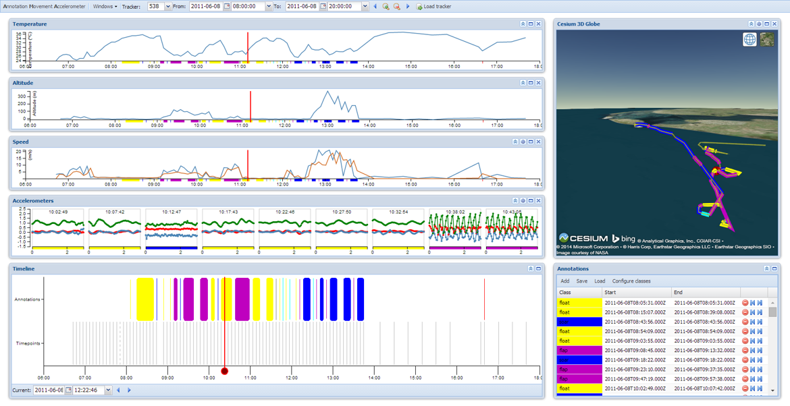

eEcology Annotation UI
======================

Web interface to annotate trackers in the eEcology project.

There is a demo available [http://nlesc.github.io/eEcology-Annotation-UI/demo/demo.html](http://nlesc.github.io/eEcology-Annotation-UI/demo/demo.html).

Issue tracker is available at https://services.e-ecology.sara.nl/redmine/projects/uvagps, use `Annotation` category for new issues.

Requirements
------------

To build the application several requirements must be installed:

1. SenchaCMD, build tool
2. ExtJS distribution, mvc/widget framework
3. ExtJS packages, widget components
4. CesiumJS distribution, webgl globe visualization
5. Karma, test runner
6. jsduck, document generator

### SenchaCMD

Install version 4 of SenchaCMD from http://www.sencha.com/products/sencha-cmd/download

    wget http://cdn.sencha.com/cmd/4.0.4.84/SenchaCmd-4.0.4.84-linux-x64.run.zip
    unzip SenchaCmd-4.0.4.84-linux-x64.run.zip
    chmod +x SenchaCmd-4.0.4.84-linux-x64.run
    ./SenchaCmd-4.0.4.84-linux-x64.run

### ExtJS distribution

On github the ext/ folder is not present, because it would be too big.
The ext folder should contain an unzipped ExtJS distro.

    wget http://cdn.sencha.com/ext/gpl/ext-4.2.1-gpl.zip
    unzip -d ext ext-4.2.1-gpl.zip

### ExtJS packages

1. Clone https://github.com/NLeSC/ExtJS-DateTime https://github.com/NLeSC/eEcology-ExtJSand repos
2. Build the packages according to their instructions.
3. Add packages to local repo. ExtJS package repo can be made with `sencha repository init --name NLeSC`
4. Refresh application to install packages with `sencha app refresh`

### CesiumJS

The Cesium library is also not present in the github repo.
The resources/libs/Cesium-<version> folder should contain the unzipped Cesium library downloadable from http://cesiumjs.org/downloads.html

    wget http://cesiumjs.org/releases/Cesium-1.14.zip
    unzip -d resources/libs/Cesium-1.14 Cesium-1.14.zip

### Karma

    sudo npm install -g karma-cli
    npm install

During application building the tests are run.
Tests can be run seperatly using `karma start`.
Tests are written with JasminBDD (https://jasmine.github.io) and ExtSpec (http://extspec.codeplex.com)

## JSduck

    sudo gem install jsduck

During application building the documentation will be generated in `docs/` directory.

Deploy application
------------------

1. Build it with

    sencha app build

2. Make build/production/TrackAnnot directory available on webserver.
3. Webservice url is hardcoded to /aws so deploy it on the same server as ui.

Web service
-----------

In seperate repo called 'eEcology Annotation WS'.

Copyrights & Disclaimers
------------------------

eEcology script wrapper is copyrighted by the Netherlands eScience Center and releases under
the Apache License, Version 2.0.

See <http://www.esciencecenter.nl> for more information on the Netherlands
eScience Center.

See the "LICENSE" and "NOTICE" files for more information.
